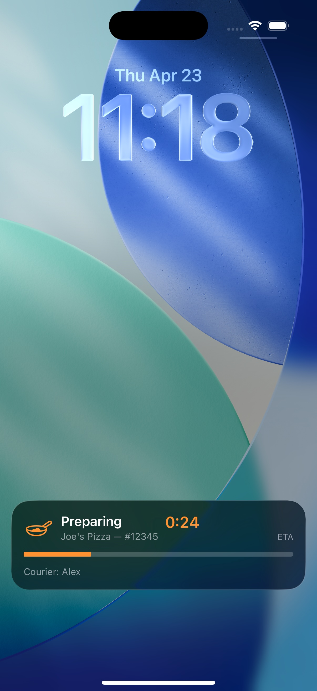
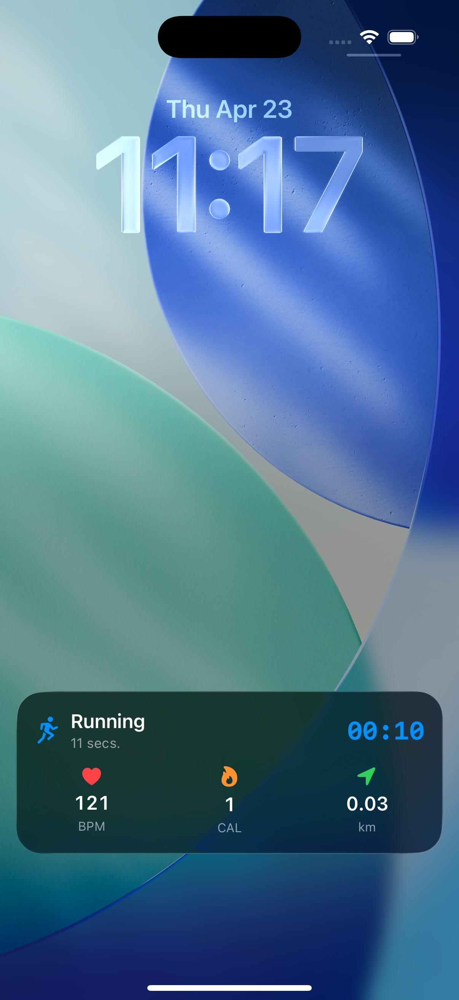

# LiveActivityDemo

A SwiftUI sample app demonstrating iOS Live Activities with Dynamic Island and Lock Screen presentations using ActivityKit.

## Demo

| Delivery Tracker | Sports Score |
|:---:|:---:|
|  | <!-- TODO: add Screenshots/screenshot_sports.jpg --> |

## Features

### 1. Delivery Tracker
Track a food delivery through 4 stages: Preparing, Picked Up, On the Way, and Delivered. Features a progress bar, courier info, and ETA countdown in both Dynamic Island and Lock Screen presentations.

### 2. Sports Score
Follow a live basketball game with real-time score updates. Supports +2 and +3 point scoring for each team, quarter progression, and game clock. The Dynamic Island shows team emojis and scores at a glance.

### 3. Workout Timer
Monitor an active workout session with simulated real-time stats: elapsed time, heart rate, calories burned, and distance. Supports running, cycling, and swimming workout types with automatic updates every 5 seconds.

## Live Activity Presentations

Each demo provides four presentation modes:

| Mode | Description |
|------|-------------|
| **Lock Screen / Banner** | Full-width presentation with detailed stats |
| **Dynamic Island Expanded** | Rich multi-region layout (tap to expand) |
| **Dynamic Island Compact** | Leading + trailing summary (always visible) |
| **Dynamic Island Minimal** | Single icon when sharing with another activity |

## Architecture

Lightweight MVVM.

| Layer | Description |
|-------|-------------|
| **Models** | `DemoType` enum for navigation; `LiveActivityHelper` for cross-type cleanup |
| **ViewModels** | `@Observable` classes that own Live Activity lifecycle (request / update / end) and simulation timers |
| **Views** | SwiftUI demo screens plus reusable subviews (status card, scoreboard, workout card, stat item) |
| **Shared** | `ActivityAttributes`, `DeliveryStatus`, `WorkoutType` — compiled into both app and widget targets |
| **Widget Extension** | `ActivityConfiguration` with Dynamic Island + Lock Screen UIs |

### Data Flow

```
View → @Observable ViewModel
         ↓
    ActivityKit API (request / update / end)
         ↓
    Widget Extension (ActivityConfiguration renders UI)
```

## Key Technologies

- **ActivityKit** — Live Activity lifecycle management
- **WidgetKit** — `ActivityConfiguration` for rendering Live Activity UIs
- **SwiftUI** — All UI built with SwiftUI
- **Dynamic Island** — Compact, expanded, and minimal presentations

## Requirements

- iOS 17.0+
- Xcode 26.4
- Swift 5 language mode

## Project Structure

```
LiveActivityDemo/
  LiveActivityDemoApp.swift            # App entry point
  ContentView.swift                    # Navigation to 3 demos
  Models/
    DemoType.swift                     # Demo type enum (title/subtitle/icon/color)
    LiveActivityHelper.swift           # Ends any in-flight Live Activity across types
  ViewModels/
    DeliveryDemoViewModel.swift        # Delivery lifecycle + auto-advance timer
    SportsScoreDemoViewModel.swift     # Sports lifecycle + scoring logic
    WorkoutTimerDemoViewModel.swift    # Workout lifecycle + simulated stats
  Views/
    DeliveryDemoView.swift             # Delivery tracker screen
    DeliveryStatusCard.swift           # Reusable delivery status card
    SportsScoreDemoView.swift          # Sports score screen
    ScoreboardView.swift               # Reusable scoreboard
    TeamColumnView.swift               # Reusable team column
    WorkoutTimerDemoView.swift         # Workout timer screen
    WorkoutCard.swift                  # Reusable workout summary card
    StatItemView.swift                 # Reusable labeled stat tile
  Shared/
    DeliveryAttributes.swift           # Delivery ActivityAttributes
    DeliveryStatus.swift               # Delivery status enum (4 stages)
    SportsGameAttributes.swift         # Sports game ActivityAttributes
    WorkoutAttributes.swift            # Workout ActivityAttributes
    WorkoutType.swift                  # Workout type enum (running/cycling/swimming)

LiveActivityDemoWidget/
  LiveActivityDemoWidgetBundle.swift   # Widget bundle entry point
  LiveActivities/
    DeliveryLiveActivity.swift         # Delivery Dynamic Island + Lock Screen
    SportsGameLiveActivity.swift       # Sports Dynamic Island + Lock Screen
    WorkoutLiveActivity.swift          # Workout Dynamic Island + Lock Screen

LiveActivityDemoTests/                 # Swift Testing unit tests
LiveActivityDemoUITests/               # XCTest / XCUIAutomation UI tests
```
